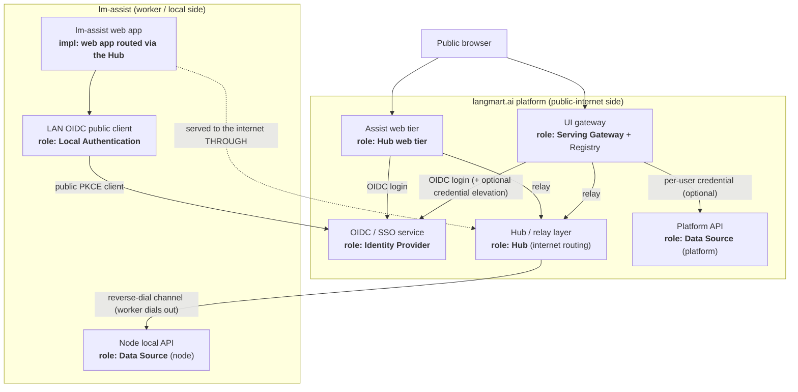
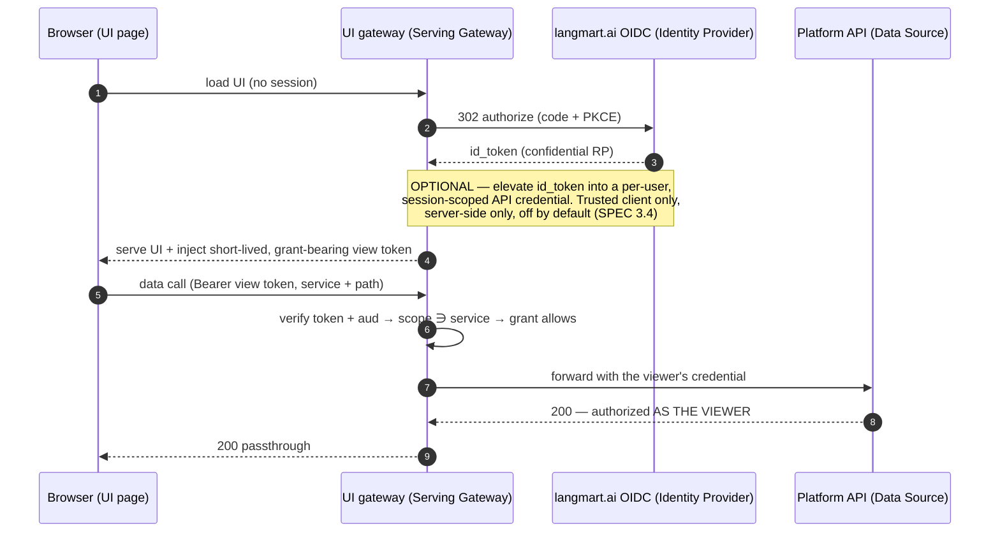
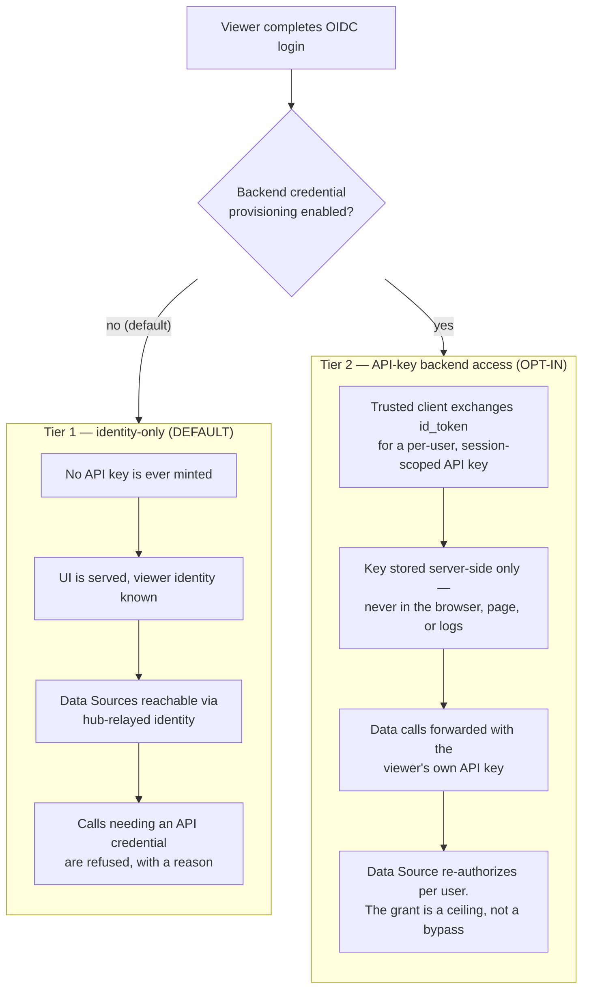
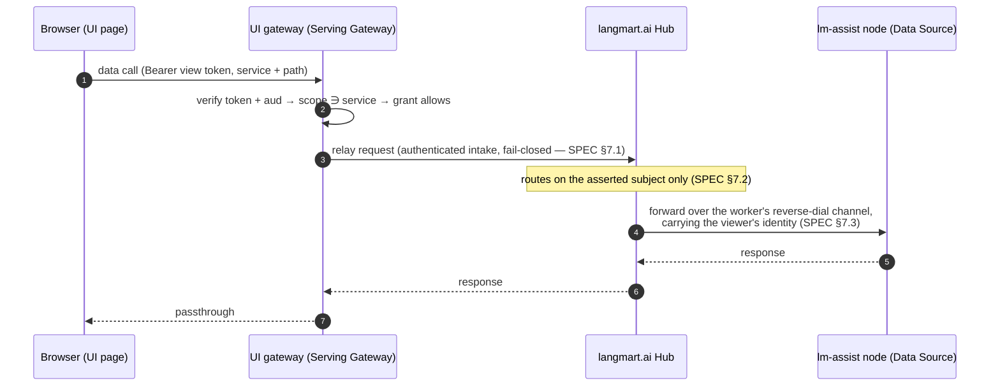
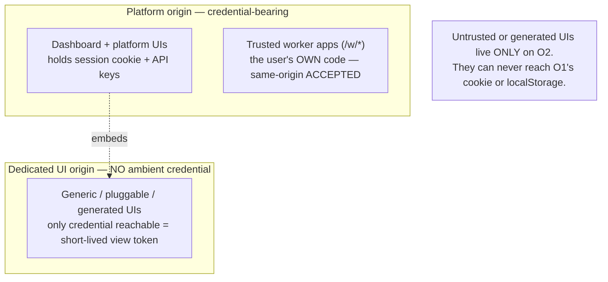

# AUIS — Reference Architecture (langmart.ai)

How the abstract roles in [SPEC.md](SPEC.md) map onto the langmart.ai deployment. The spec
is normative and technology-free; this document is one conforming realization, described
at the architecture level.

## Role → component mapping

| AUIS role (SPEC.md §1) | Realized by |
|---|---|
| **Identity Provider** (SSO / OAuth) | **langmart.ai** — the platform's OIDC/SSO service |
| **Hub** (internet-facing relay + routing) | **langmart.ai** — the platform's hub/relay layer |
| **Hub web tier** (internet-facing UI edge) | **langmart.ai** — the platform's assist web tier |
| **Serving Gateway + Registry** | **langmart.ai** — the platform's UI gateway |
| **Data Source** (platform) | **langmart.ai** — the platform API |
| **Web-app implementation** (routed to the internet *through* the Hub) | **[lm-assist](https://github.com/langmartai/lm-assist)** — its web app |
| **Local Authentication** (LAN OIDC public client) | **lm-assist** — its LAN login |
| **Data Source** (node) | **lm-assist** — its node's local API |

**The division of responsibility:** SSO/OAuth and the hub internet-routing both reside on
the **langmart.ai platform** (Identity Provider, Hub, hub web tier, UI gateway).
**lm-assist is a web-app implementation** that is routed to the public internet *through*
that hub — a consumer of the Hub and Identity Provider, not the hub itself. lm-assist
additionally implements Local Authentication and hosts a node Data Source.

## Who lives where

## Login + data flow (platform scope, credential provisioning ON)

## The two access tiers (what "optional" means in practice)

Baseline is **pure OIDC identity**. API-key-based backend access is an **opt-in add-on**
(SPEC §3.4, §6.0) — enable it only for scopes whose Data Source requires an API credential.

Both tiers keep the same invariant: the browser holds only the short-lived, grant-bearing
view token. Tier 2 adds a server-side credential, never a browser-side one.

## Hub-relayed flow (node scope: internet edge → worker node)

## Origins and the trust boundary (SPEC §5.3)

Three classes of served content sit on deliberately different origins:

- **Platform origin** carries the viewer's session cookie and saved API keys. The dashboard
  and **trusted worker apps** (`/w/*`, the user's own code) live here; same-origin is an
  accepted trust decision, not a defect (SPEC §5.3, first bullet).
- **Dedicated UI origin** (a distinct subdomain, e.g. a `ui.`-prefixed host) serves the
  **generic / pluggable / generated** UIs and holds *no* ambient platform credential. On
  this origin the only credential a page can reach is its short-lived, grant-bearing view
  token, so even fully untrusted (agent-generated) UIs cannot exfiltrate account
  credentials. This is where the pluggable-UI framework's generated UIs are served.

## Notes

- **Internet exposure of lm-assist:** the lm-assist web app and node live on a worker/LAN;
  they reach the public internet **only through the langmart.ai hub** (SPEC §7.4 — the Hub
  is the scope's internet-facing part, not a separate scope).
- **Two authentication surfaces, one IdP:** the platform's internet-facing web tiers are
  confidential OIDC relying parties; lm-assist's LAN login is a public PKCE client. Both
  authenticate against the same langmart.ai identity (SPEC §3.2).
- **Access tiers:** pure OIDC identity is the baseline; per-user backend credential
  provisioning is opt-in and off by default (SPEC §3.4, §6.0).
