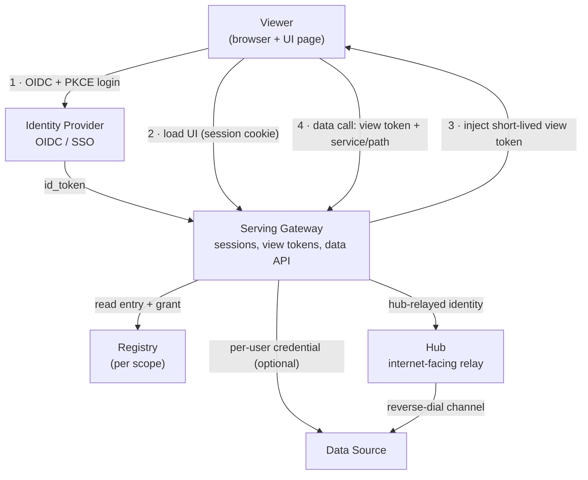

# Agentic UI Specification — AUIS v0.3

Status: draft. Requirement language: MUST / MUST NOT / SHOULD / MAY per RFC 2119.

This document defines **roles and contracts, not technologies**. Where a concrete
protocol is named (OIDC, PKCE, JWT, CSP) it is cited as an interoperable protocol, not a
product choice. A codebase that satisfies every MUST is a conforming implementation.

**Purpose.** Let UIs — including UIs generated on demand by an agent — be served,
authenticated against a SaaS identity, and given *narrow, per-viewer* access to backend
APIs and data, without ever handing the browser a durable credential.

## 1. Roles

| Role | Responsibility |
|---|---|
| **Identity Provider (IdP)** | Authenticates humans; issues OIDC id_tokens. One IdP serves all scopes — identity is global, authority is scoped. |
| **Scope** | A sovereign realm: a registry, one or more serving points, and a closed set of data-plane **services**. |
| **Registry** | The scope's catalog of UIs: identity, artifact location, owner, access mode, and the **grant** (§4). |
| **Serving Gateway** | Serves UI artifacts, establishes IdP sessions, mints view tokens, and fronts the data plane (§6). |
| **Data Source** | What a service name resolves to: a platform API, a node's local API, a customer datastore. |
| **Hub** | An internet-facing routing layer relaying requests to Data Sources that dial out to it (§7). |
| **UI** | A directory of static artifacts, registered in exactly one scope. |

### 1.1 Architecture at a glance (abstract)

Roles and the trust direction between them. No role is a product; see
[ARCHITECTURE.md](ARCHITECTURE.md) for how a concrete deployment maps onto them.



## 2. Scopes and registries

2.1. Every UI MUST belong to exactly one scope; its registry entry, serving, and data
access MUST all be functions of that one scope.

2.2. Each scope MUST declare a closed set of service names. A registry MUST reject an
entry whose grant names a service outside its scope's set — a *structural* wall enforced
at registration, so a nonconforming entry cannot exist, not merely cannot act.

2.3. A scope MAY have multiple serving tiers (e.g. an internet-facing hub tier and a
local/LAN tier); both serve the same registry entries under the same contracts.

2.4. A registry entry MUST carry at minimum: `uiId` (unique per owner within the scope —
§2.7), `name`, artifact location, `ownerUserId` (the OIDC `sub` it is bound to — see §5.4),
`enabled`, and the `grant` (§4).

2.5. Registration MUST be authenticated and MUST bind `ownerUserId` to the authenticated
subject. A caller MUST NOT register or mutate another owner's entry.

2.6. Grant breadth MUST be validated at registration: a prefix that matches every path
(e.g. `/`) MUST be rejected; a service outside the scope MUST be rejected (2.2); verbs
MUST be a subset of a known method set.

2.7. **A uiId is a name inside its owner's namespace, not a global name.** A registry MUST
NOT make the bare `uiId` its primary key: doing so lets whoever registers `dashboard` first
take that name away from everyone else, and makes every later registration of it a
first-come collision rather than a private choice. The globally unique identity of a UI is
its **uiKey**, and the serving origin is derived from that:

```
uiKey  = <ownerSlug>-<uiId>
origin = ui-<uiKey>.<domain>          e.g. ui-3f9a2b1c-dashboard.example.com
```

`ownerSlug` MUST be exactly 8 hexadecimal characters identifying the UI's owner, and MUST
be *derived from* the owner's identifier rather than being a prefix of it. An origin is
public; publishing part of an identifier that is used elsewhere is a disclosure the
addressing scheme does not need. A hash prefix names the owner's namespace without saying
anything about the owner. Uniqueness MUST rest on an allocation record, not on the hash's
collision resistance: on a collision the implementation MUST allocate a different slug
rather than let two owners share one.

The width is fixed because a `uiId` may itself contain hyphens. With a variable-width
prefix, `a-b-c` could not be split back into owner and uiId unambiguously; at a fixed width
the composite parses by position.

2.8. **An app origin MUST occupy a single DNS label.** `ui-` + 8 + `-` + `uiId` MUST fit
within the 63-character limit of one label, which caps a `uiId` at **51 characters**; a
registry MUST reject a longer one. This is what keeps one pre-allocated `*.<domain>`
wildcard certificate covering every app origin in a deployment — no per-owner or per-UI
certificate, DNS record, or proxy rule is ever issued.

2.9. **Bare ids in, qualified ids out.** UI configuration and registration MUST declare the
bare `uiId`; the owner prefix is addressing applied by the implementation, not something an
author writes. An API that names a UI in a path or body MUST accept either form, and MUST
resolve a bare `uiId` only within the calling subject's own namespace — so a guessed name
can never reach another owner's UI. Registration and listing responses MUST return the
`uiKey` and a fully-qualified `origin`; a client MUST use the returned `origin` rather than
assembling a hostname from parts, because how an origin is composed is the implementation's
business and may change.

2.10. Interfaces shown to humans SHOULD display the bare `uiId` (or the UI's `name`). The
owner slug is machine addressing and is noise to a reader.

2.11. **Presentation metadata.** A registry entry MAY carry `category` (string) and
`sortOrder` (integer, default 100). A host that lists UIs (a launcher, sidebar, catalog)
SHOULD order entries by the total order (`sortOrder`, `name`, `uiKey`) — the tiebreakers
make the listing deterministic — SHOULD group by `category` with each group positioned
where its first member falls in that order, and SHOULD place entries without a category
under a generic heading rather than inventing one. These fields are advisory presentation
data: they MUST NOT affect serving, grants, or access decisions.

## 3. Authentication

3.1. Human authentication MUST be OIDC authorization-code with PKCE (S256) against the
IdP, which MUST keep a controlled client registry (no open dynamic registration for
these flows).

3.2. **Two client classes, by network exposure — both are required by this spec:**

- **Internet-facing authentication.** A serving point reachable from the public internet
  MUST be a *confidential* relying party: client secret held server-side, session as an
  HttpOnly cookie referencing server-side state, no token exposed to page script.
- **Local authentication.** A serving point on a private network (LAN/loopback) whose
  redirect target is not a stable public URL MUST be a *public* (secret-less) relying
  party with PKCE mandatory, and the IdP MUST restrict its redirect URIs to
  private-address shapes **by parsed host**, not string match. A public client MUST NOT
  be eligible for credential elevation (3.4): *public ⊕ trusted* is an invariant the IdP
  MUST enforce structurally.

3.3. IdP-issued tokens MUST be structurally distinct from backend API credentials:
possession of an OIDC token MUST NOT authenticate to any API surface that expects an API
credential. Login proves identity; it must not *be* power.

3.4. **Credential elevation is OPTIONAL.** The baseline access tier is **pure OIDC
identity**: a serving point MAY authenticate a viewer and serve a UI with no backend
credential at all — sufficient to establish *who* the viewer is and to reach Data Sources
that accept the OIDC identity directly (e.g. via the hub-relayed strategy, 6.3). An
implementation MAY *additionally* provision a backend API credential for UIs that call a
Data Source requiring an API credential (the per-user-credential strategy, 6.3). When it
does, elevation MUST be restricted to clients the IdP explicitly marks trusted, MUST
derive the credential's subject solely from the verified token's `sub` (never
caller-supplied), and MUST yield a credential scoped and expiring like a session.
Provisioning MUST be opt-in (per implementation, scope, or UI) and off by default; a
serving point that never provisions is a conforming identity-only deployment.

## 4. Grants and view tokens

4.1. A **grant** is a list of rules `{service, pathPrefix, verbs}`. Prefix matching MUST
be segment-boundary: `/a` matches `/a` and `/a/…`, never `/ab`.

4.2. A **view token** is a short-lived (≤ 15 min) signed token minted per page load,
carrying `sub` (viewer), `aud` (the **uiKey** — §2.7, never the bare uiId), the grant,
issuer, and expiry. It is the *only* credential a UI page ever holds.

4.3. Verification MUST check signature, issuer, expiry, **and audience against the UI
being addressed**. The audience MUST be compared as the `uiKey`. This is the
security-critical consequence of §2.7: once two owners may each have a UI named
`dashboard`, a bare-uiId audience would let a token minted for one owner's page validate on
the other owner's origin — the audience check would no longer identify a UI. A token minted
for one UI MUST NOT be accepted for another.

4.4. The serving point MUST offer authenticated re-mint (session → fresh token for a UI
the session may load), so a UI outlives the token TTL without ever holding a long-lived
credential.

4.5. A token MUST be delivered only to real document navigations (via fetch-metadata or
an equivalent discriminator); a programmatic same-origin fetch of a UI's page MUST NOT
receive a token.

4.6. **Consent follows the party, not the name.** Any record of access a user has granted a
UI at runtime MUST be keyed by `uiKey`. Keyed by the bare `uiId`, consent would attach to a
name: were a name released and registered by someone else, the new registrant would inherit
every grant users had made to the old one. Keyed by `uiKey`, a grant can only ever be
exercised by the owner it was given to.

## 5. Serving

5.1. A UI artifact is static — an entry document plus assets. The serving point injects
the view token and the UI's identity — its `uiId` and the `uiKey` the token is addressed to
(§2.7) — into the entry document at serve time. UIs MUST NOT require server-side rendering.

5.2. Serving MUST require an authenticated session for the entry document AND its assets.

5.3. **Origin isolation by trust.** A restrictive content-security policy MUST confine the
page to its serving origin (no external script/style/font/connect).

- **Trusted first-party apps** (code the viewer themselves operate — e.g. a worker app the
  user runs) MAY be served from a credential-bearing origin under an *explicit, documented
  trust decision*: the app's code is the user's own, so its access to that origin's
  credentials is not a privilege escalation. Such apps MAY use inline script/style.
- **Untrusted or generated UIs** (agent-authored, third-party, or shared) MUST be served
  from a **dedicated origin that holds no ambient platform credential** — a separate
  subdomain per deployment and, for stronger isolation, per UI: one owner-qualified origin
  each (§2.7), so that two owners' UIs of the same name never share one. They MUST NOT be
  served from, or framed such that they can reach, an origin carrying the viewer's session
  cookie or API keys. This origin separation — not the CSP alone — is what lets untrusted
  code be admitted at all: on it, the only credential reachable is the short-lived view
  token.

5.4. **Access is bound to one identity: the owner's.** A UI records the OIDC `sub` that
registered it, and MUST be loadable **only** when the authenticated subject equals that
owner. It is also listed only in that owner's catalog — another user cannot see that it
exists, let alone open it.

This is a deliberate structural choice, not a policy default, and it is what keeps a
pluggable UI in the same trust posture as any application a user runs for themselves: the
author and the viewer are **always the same person**. An "any authenticated user may open
it" mode would mean one user's code executing in another user's browser, which is the
precondition for a whole class of attacks that no amount of downstream mitigation removes:

- **cookie tossing / session fixation** — cookies are scoped by registrable domain, not
  origin, so third-party code on a sibling host can overwrite a session cookie;
- **borrowed-brand phishing** — hostile code served from the platform's own domain wears the
  domain as a trust signal;
- **cross-UI credential theft** — one UI inducing the serving point to mint or reveal
  another UI's view token.

Forbidding the mode removes the precondition for all of them at once. Implementations MUST
NOT offer a "shared" or "public" access mode.

An anonymous/share-link mode is reserved and MUST NOT be implemented without
self-describing, expiring, revocable capability tokens **and** an origin that carries no
ambient credential (§5.3) — because a share link reintroduces exactly the author ≠ viewer
condition this clause removes.

5.5. **Embedded serving.** A host MAY embed a UI's document in a frame, passing
`embed=1` (and optionally `theme=light|dark`) as query parameters; the UI restyles for
the chrome-less container. The host MUST size the frame itself — RECOMMENDED: fix it to
the full content area the host allots — and MUST NOT size the frame from UI-reported
dimensions: a full-height UI can only echo back whatever height it was given, so
sizing-from-content is circular. An embedded UI SHOULD post a liveness message to its
parent (e.g. `{type:'lmui:height', uiId, height}` via `postMessage`); the host MAY use
it to detect a dead or stalled UI and MUST treat it as advisory. Inside the frame the
viewport IS the allotted area — the UI MUST keep all of its content reachable by its own
internal scrolling and MUST NOT assume the host scrolls the frame.

## 6. Data plane — credentials and backend API access

This is the heart of the spec: how a served UI reaches backend APIs and data, and which
credential is used at each hop.

6.0. **Two access tiers.** Every UI is at least **identity-only**: served, viewer known,
no backend credential. A UI is additionally **backend-credentialed** only if its scope/
service uses the per-user-credential strategy (6.3) AND provisioning is enabled (3.4).
Identity-only is the default and the minimum; backend-credentialed is opt-in. A UI that
declares no grant, or only a grant against a hub-relayed service, needs no provisioning.

6.1. **Up to three credentials, one direction of trust.** An implementation MUST
distinguish:

| Credential | Held by | Lifetime | Reaches | Present |
|---|---|---|---|---|
| **Session** (OIDC) | browser, HttpOnly cookie | session | the serving point only | always |
| **View token** (grant-bearing) | the UI page, in memory | ≤ 15 min | the serving point's data API only | always |
| **Backend credential** (per user) | serving point, server-side | session-scoped | the Data Source | **only when provisioned (3.4)** |

The browser MUST hold only the view token. The backend credential, when it exists, MUST
NOT reach the browser, MUST NOT appear in any served artifact, and MUST NOT be logged.
This ordering is the whole point: a UI page can act, but only within its grant, and only
for as long as a short token lives — and only against backends for which a credential was
deliberately provisioned.

6.2. **The request path.** A UI reaches data ONLY through its serving point's data API,
presenting its view token, naming a `service` and `path`. The serving point MUST, in
order: verify the view token, including `aud` against the addressed UI's `uiKey` (4.3);
confirm the named service belongs to the UI's scope (2.2); check `{service, method, path}`
against the grant (4.1); then resolve the service to a Data Source (6.4) and forward the
request with the appropriate backend credential. A grant denial MUST name the denied
`{service, path}`.

6.3. **Service resolution.** Each service name in a scope MUST map to (a) a Data Source
and (b) a credential strategy. Two strategies are defined:

- **Per-user backend credential** — the serving point forwards to the Data Source using
  the *viewer's* backend credential (6.1, obtained via elevation 3.4 at login). Use this
  where the Data Source authenticates individual users. The Data Source's own
  authorization then applies in full (6.5).
- **Hub-relayed identity** — the serving point forwards through a Hub (§7) to a Data
  Source that authenticates the *channel*, not the user; the viewer's identity travels as
  an asserted header the Data Source is expected to enforce (7.3). Use this only where the
  Data Source cannot yet take a per-user credential — and record the resulting gap (6.6).

6.4. **The viewer's-authority rule.** Data access MUST be authorized as the *viewer* (the
token's `sub`) — never as the UI's author, never as an ambient privileged principal. Under
§5.4 the viewer and the author are the same subject, so this reduces to "the UI acts as its
owner"; the rule is stated in terms of the viewer because that is what the data plane can
actually check, and it must keep holding if a share-link mode is ever added.
Under the per-user strategy this is intrinsic (the viewer's credential is used). Under the
hub-relayed strategy the Data Source MUST enforce the asserted identity; until it does,
6.6 applies.

6.5. **The grant is a ceiling, not a bypass.** A Data Source with its own authorization
MUST still apply it. The grant narrows what a UI *may attempt*; it never widens what the
viewer *may access*. Effective access = grant ∩ scope-services ∩ the Data Source's own
per-user authorization.

6.6. **Honest degradation.** If a service uses the hub-relayed strategy and the Data
Source does not yet enforce the asserted viewer identity (i.e. it runs relayed calls as a
shared/owner principal), the implementation MUST (a) treat every UI on that service as
*owner-scoped, not per-viewer*, and (b) record the unmet 6.4 requirement in its
conformance ledger with its compensating controls. A per-viewer claim that the Data
Source cannot enforce MUST NOT be presented as if enforced.

## 7. Hub routing (internet-facing relay)

7.1. A Hub relays data-plane requests from an internet-facing tier to Data Sources that
dial out to it (reverse connection). The Hub's relay intake MUST be authenticated (shared
secret or stronger) and MUST fail closed in **every** environment when unconfigured; an
explicit, named development override MAY exist but MUST default off.

7.2. The Hub MUST route on the asserted subject only to Data Sources belonging to that
subject. Any fallback routing one subject's request to another subject's Data Source MUST
be opt-in and off by default.

7.3. The Hub MUST forward the viewer's identity under a defined header contract so Data
Sources can enforce per-user authorization (6.4). A Data Source MUST trust that identity
only on its authenticated Hub channel, never from an arbitrary caller.

7.4. A scope's local tier becomes internet-reachable ONLY via its Hub tier. The Hub is
that scope's internet-facing part — not a scope of its own.

7.5. **The UI's local server holds no Hub credential.** The reverse connection to the Hub
belongs to a host *agent* — one authenticated connection per host, not per UI — which
forwards relayed requests to local, loopback-bound UI servers according to declared
routes. A UI author's serving tool MUST be runnable with no credential of any kind; the
registry entry names the *host* whose agent serves the UI, and the Hub routes to that
host's connection (7.2). This bounds credentials by hosts rather than UIs and keeps the
authoring path consistent with the no-credential rule of §8.

## 8. UI authoring contract

A conforming UI MAY assume, and MUST limit itself to:

- Injected globals: the view token, the UI's `uiId`, and the `uiKey` the token is
  addressed to (§2.7). A UI addresses itself to its own serving point by either form (2.9)
  and shows the bare `uiId` to its viewer (2.10).
- A data API at its own origin taking the view token as a bearer credential, addressed as
  `service` + `path` (6.2).
- Re-mint (4.4) on authentication expiry.
- Embedded rendering (5.5): honor the `embed`/`theme` query parameters, post the
  liveness message, size to its own viewport, and scroll internally.
- Nothing else: no cross-origin fetch, no ambient cookies for data, no server-side code,
  no knowledge of any backend credential.

*Non-normative: [GUIDE.md](GUIDE.md) develops this contract into page-design practice —
identity badge, live access panel, token state, and the runtime grant lifecycle.*

## 9. Conformance

An implementation MUST maintain a conformance ledger enumerating every MUST it does not
yet meet, each with its compensating control (see 6.6). A requirement silently unmet is a
defect; a requirement listed with its gap is a roadmap. Conformance is claimed *per role*
— an implementation may conform as a Serving Gateway while another component supplies the
IdP or Hub role.
